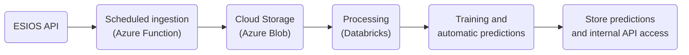

# Exercise 2 – Production Deployment Design

**Author:** Ignacio Layo González  
**Context:** Technical design proposal for deploying the forecasting pipeline (Exercise 1) into a realistic, maintainable, and scalable production setup.

## 1. Objective

This document explains how to bring the MVP developed in **Exercise 1** into production.  
The current version runs locally: it fetches data from the ESIOS API, builds time-based features, and trains and applies a Random Forest model.

The goal is to transform that code into a **reliable, automated data pipeline** running in the cloud (Azure), ensuring traceability, reproducibility, and maintainability.

---

## 2. General approach

The idea is to keep the same logic from the existing scripts (`etl.py`, `process_features.py`, `run_model.py`) but run them in an orchestrated and automated way in the cloud, with shared storage and job scheduling.

The overall pipeline flow would be:

---

## 3. Main components

### 🔹 Ingestion
- An **Azure Function** (or simple cron job) runs `etl.py` every hour.  
- It downloads data from ESIOS and saves it as **Parquet** in an **Azure Blob Storage** container (`/data/raw/`).  
- The ESIOS API token is managed securely using **Azure Key Vault** or environment variables.  
- Logs are written for each run, including success/failure and HTTP response status.

### 🔹 Processing and feature generation
- A second job runs `process_features.py` in **Azure Databricks** or on a **lightweight Python VM**.  
- It aggregates the data to hourly resolution and creates lag, rolling, and time features.  
- The processed data is stored in `/data/processed/` within the same Blob container.

### 🔹 Model training and tracking
- A daily or weekly job trains a new model (`model.py`) with the latest processed features.  
- The trained model is saved with `joblib`, versioned by date or iteration.  
- Optionally, **MLflow** (in Databricks or local) is used to log metrics and model versions.

### 🔹 Predictions
- Each hour, once the new features are ready, the model runs a T+6 forecast using `make_recursive_forecast()`.  
- Predictions are stored as Parquet in `/data/predictions/`.  
- These files are directly accessible by the Trading team or through a small internal API.

---

## 4. Orchestration and automation

Depending on the environment maturity, we can rely on different options:

### 🟢 Simple: **Azure Functions + Cron Jobs** - Lightweight, cost-effective setup using scheduled scripts.
### 🟡 Intermediate: **Azure Data Factory** - Visual orchestration and monitoring of all pipeline steps.
### 🔵 Advanced: **Databricks Workflows** - Full orchestration within Databricks with metrics and alerts.

Each stage (ingest → features → predictions) becomes an independent **job** with clear dependencies and retry policies.

---

## 5. CI/CD and version control

To ensure code quality and repeatable deployments:

- **GitHub repository** with `main` and `dev` branches.  
- **GitHub Actions** runs:
  - Unit tests (`pytest`) for `etl.py`, `process_features.py`, `run_model.py`.  
  - Linting (`flake8`) for consistent style.
- Upon merging to `main`, the CI/CD workflow updates scheduled jobs in Azure or Databricks.
- Each trained model is versioned and linked to the corresponding Git commit hash.

---

## 6. Security and configuration

- Secrets such as the ESIOS API key are stored in **Azure Key Vault** or secure environment variables.
- No credentials are stored in the repository.
- Storage access follows the principle of least privilege.
- Logs are centralized (log files or Azure Monitor), and alert notifications can be sent via email or Teams.

---

## 7. Monitoring and maintenance

- **Automatic logs** for ingestion, feature generation, and model training.  
- **Alerts** when:
  - A job fails or runs longer than expected.
  - Model performance degrades (for example, MAE increases by >20%).
- **Basic metrics** displayed in a lightweight dashboard (Azure Monitor or Streamlit):
  - Latest available timestamp.
  - Mean Absolute Error (MAE).
  - Job duration and success rate.

---

## 8. Data pipeline summary

| Step | Script / Component | Frequency | Output |
|------|--------------------|------------|---------|
| Ingestion | `etl.py` | Hourly | Raw Parquet files (`data/raw/`) |
| Processing | `process_features.py` | Hourly | Processed features (`data/processed/`) |
| Training | `train_model.py` | Daily / Weekly | Versioned model (`.joblib`) |
| Forecasting | `run_model.py` (forecast) | Hourly | Predictions (`data/predictions/`) |

---

## 9. Future improvements

- Add **integration tests** covering the full data pipeline.  
- Implement **data drift monitoring** to detect model degradation.  
- Automate model promotion based on performance metrics.

---

## 10. Conclusion

This design brings the MVP from Exercise 1 into a **lightweight production setup**, using:
- The same Python scripts already implemented.  
- Cloud storage (Azure Blob).  
- Simple scheduling (Azure Functions or Databricks Jobs).  
- Logging, versioning, and monitoring.

The result is an automated, hourly prediction pipeline that supports the Trading team with minimal operational overhead and clear paths for future improvement.

---